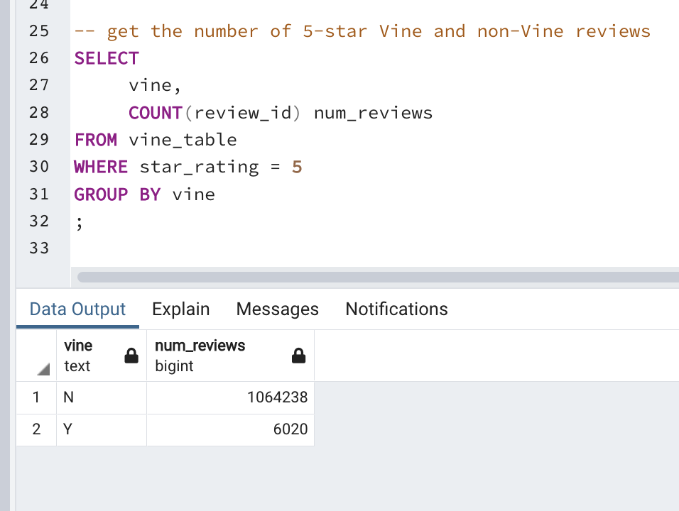

# Amazon_Vine_Analysis

## Overview

Using a dataset of Amazon reviews, we set out to determine whether reviews written by members of the Vine program showed bias toward 5-star reviews. From Amazon Vine's [About](https://www.amazon.com/vine/about) page: 
>Amazon Vine invites the most trusted reviewers on Amazon to post opinions about products to help their fellow customers make informed purchase decisions. Amazon invites customers to become Vine Voices based on the insightful reviews they published on their past purchases and helpfulness of their reviews. Amazon offers Vine members free products that have been submitted to the program by participating selling partners. Vine reviews are the independent opinions of the Vine Voices and the selling partners cannot influence, modify or edit the reviews. Amazon does not modify or edit Vine reviews, as long as they comply with our posting guidelines.

**The Amazon Review Dataset:**
The review dataset for our analysis was sourced here: 
https://s3.amazonaws.com/amazon-reviews-pds/tsv/index.txt

**US Amazon Reviews for Baby-Related Products**
We specifically reviewed this dataset for bias. 
https://s3.amazonaws.com/amazon-reviews-pds/tsv/amazon_reviews_us_Baby_v1_00.tsv.gz


## Results

* How many Vine reviews and non-Vine reviews were there?
    * there were 12,100 Vine reviews and 
    * 1,740,832 non-Vine reviews
* How many Vine reviews were 5 stars? How many non-Vine reviews were 5 stars? (*see the query directly below for these counts*)
    * there were 6,020 Vine reviews were 5 stars and
    * 1,064,238 non-Vine reviews were 5 stars


* What percentage of Vine reviews were 5 stars? What percentage of non-Vine reviews were 5 stars? (*see query below and the table of results for a bit more context*)
    * 49.8% of Vine reviews were 5 stars and 
    * 61.1% of non-Vine reviews were 5 stars


```
SELECT 
	 COUNT(review_id) as total_reviews,
	 SUM(CASE WHEN star_rating = 5 THEN 1 ELSE 0 END) num_five_star_reviews,
	 SUM(CASE WHEN vine = 'Y' AND star_rating = 5 THEN 1 ELSE 0 END)::FLOAT 
		 / 
	 	SUM(CASE WHEN vine = 'Y' THEN 1 ELSE 0 END)::FLOAT * 100 as pct_vine_five_star_reviews,
	 SUM(CASE WHEN vine = 'N' AND star_rating = 5 THEN 1 ELSE 0 END)::FLOAT 
	 	/ 
		SUM(CASE WHEN vine = 'N' THEN 1 ELSE 0 END)::FLOAT * 100 as pct__reviews
FROM vine_table 
;
```

| **total_reviews** | **num_five_star_reviews** | **pct_paid_reviews** | **pct_unpaid_reviews** |
|-------------------|---------------------------|----------------------|------------------------|
| 1752932           | 1070258                   | 49.75206611570248    | 61.133871620006985     |

<sup>Results are also saved here:  [Vine_Review_Analysis_Results.csv](Vine_Review_Analysis_Results.csv)</sup> 

## Summary 

With the results of our analysis at hand, there **does not** appear to be any bias toward 5-star ratings for Vine reviewers vs non-Vine reviewers. 

Given the small number of Vine reviewers, we may wish to perform some additional analysis to confirm this lack of bias. We should take the following into consideration when we conduct further analysis: 

Review the dataset in a similar manner as this analysis, but look for bias *against* poor reviews. We should compare Vine and non-Vine reviewers to see if there is a trend with regard to both 1- and 2-star reviews. While our analysis hints that there is not a bias toward 5-star reviewers for Vine program members, we would like to confirm whether this population has any hesitance in leaving poor reviews for products.  